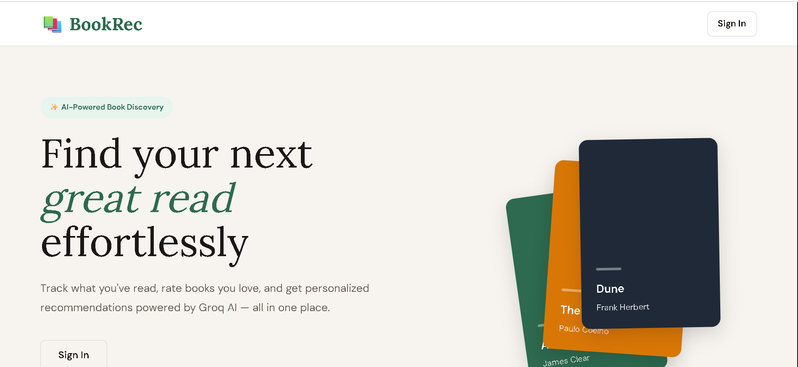
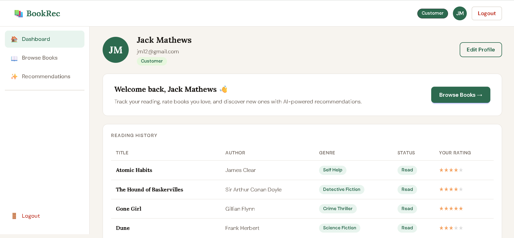
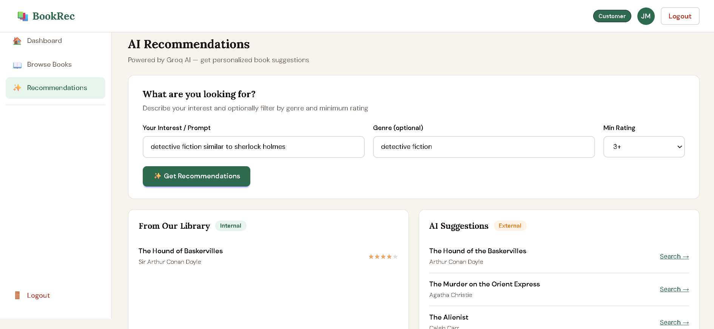
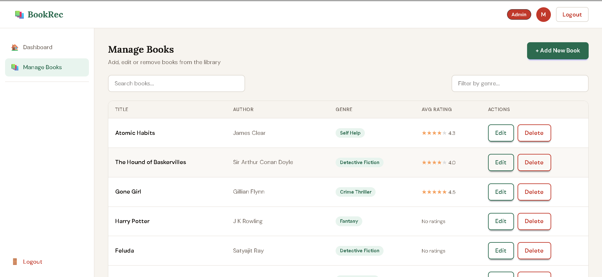
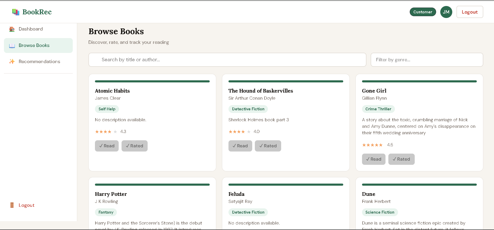
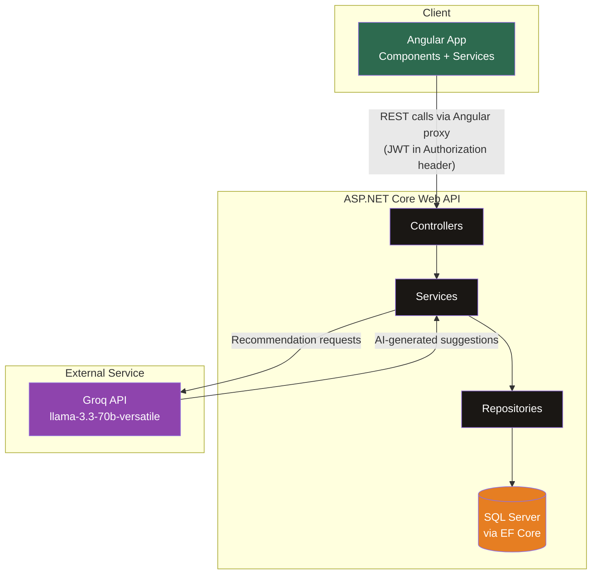
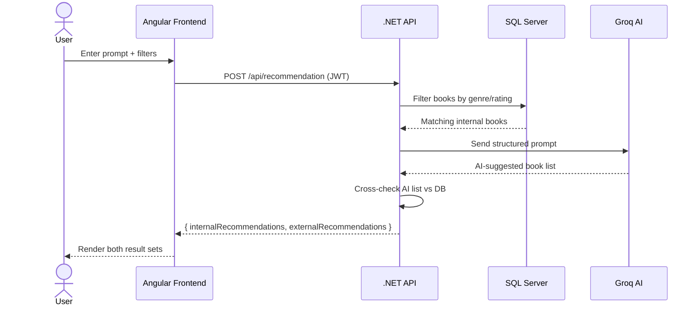
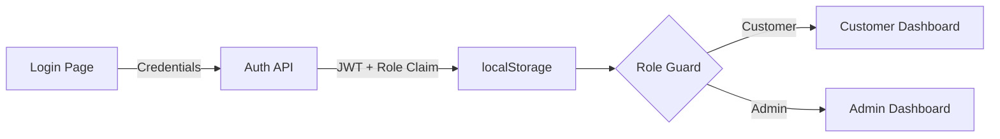

# BookRecommendationSystem
A full-stack book recommendation platform built as a training project. It combines a curated internal book library with AI-powered recommendations — so users always get suggestions, whether the book exists in the database or not.

🔗 Repo: `ritaja-BookRecommendationSystem`

---

## Screenshots

| Hero Page | Customer Dashboard | Recommendations |
|---|---|---|
 |  | 
| Admin — Manage Books | Book Listing |
|  |  |

---

## Features
- **Authentication & Authorization** — JWT-based auth with two roles, Customer and Admin. Registration is open to customers only; admin accounts are provisioned directly via the database for security.
- **Role-based dashboards** — Customers see their profile and reading history; admins see their profile and quick links to manage the library.
- **Book catalog** — Browse all books with title, author, genre, description, and community average rating.
- **Search & filter** — Search books by title/author and filter by genre, backed by a dedicated search API.
- **Reading tracker** — Customers can mark books as read/unread, and their full reading history is shown on their dashboard.
- **Ratings** — Customers can rate books they've read (1–5). Average ratings are computed dynamically and shown across the catalog.
- **Admin book management** — Full CRUD: add, edit, and delete books from the library.
- **AI-powered recommendations** — A hybrid recommendation engine that combines internal database matches with AI-generated suggestions (see below).
- **Profile editing** — Inline profile name editing for both roles.
---
## Rating System Behavior
 
Ratings are stored per user, per book — multiple users can rate the same book, and the average is computed dynamically (not stored as a static column):
 
| Scenario | Displayed Rating |
|---|---|
| No user has rated the book | "No ratings yet" |
| Exactly one user has rated it | That single rating |
| Multiple users have rated it | Calculated average across all ratings |
 
Newly added books by an admin start with no rating — the average appears automatically once the first customer rates it.
 
---
## AI Recommendation Engine (Groq)
 
The recommendation feature uses a **hybrid approach** so users always get useful results, regardless of how big the internal library is.
 
**How it works:**
1. The user submits a prompt (e.g. *"psychological thriller with a twist ending"*) along with optional genre and minimum rating filters.
2. The backend first filters the internal database for matching books.
3. A structured prompt — including the user's input and filters — is sent to the **Groq API** (using the `llama-3.3-70b-versatile` model) to generate additional suggestions.
4. The AI's suggestions are cross-checked against the database:
   - Books that already exist internally are returned as **internal recommendations**, showing the particular book card.
   - Books that don't exist are returned as **external recommendations**, each with an author name and a ready-to-use Google search link.
5. The response returns both lists separately — `internalRecommendations` and `externalRecommendations` — so the frontend can clearly label where each suggestion came from.
Groq was chosen over the Gemini API after running into free-tier model deprecations and rate limiting (`404`/`429` errors) during development — Groq's free tier proved more reliable for this use case.
 
> Detailed request/response structure and backend implementation are documented in [`/api/README.md`](./api/README.md).
 
---
## Tech Stack
 
| Layer | Technology |
|---|---|
| Frontend | Angular (standalone components), TailwindCSS, DaisyUI |
| Backend | ASP.NET Core Web API (.NET), Repository–Service–Controller pattern |
| Database | SQL Server, Entity Framework Core |
| Auth | JWT (JSON Web Tokens), BCrypt for password hashing |
| AI | Groq API (`llama-3.3-70b-versatile`) |
| Mapping | AutoMapper |
| Testing | xUnit, Moq, FluentAssertions (backend) ; jasmine (frontend)|
 
---
## System Architecture
 

---
**Request flow example — getting a recommendation:**
 

---

**Auth & role-based flow:**
 

---
## Folder Structure
 
```
ritaja-BookRecommendationSystem/
│
├── ui/                  # Angular application
│   ├── src/app/
│   │   ├── core/              # Services, models, guards, interceptors
│   │   ├── shared/            # Reusable components (navbar, sidebar, etc.)
│   │   ├── features/          # Feature modules (auth, customer, admin, home)
│   │   └── environments/      # Environment configs (API URLs)
│   ├── proxy.conf.json         # Dev proxy config to backend API
│   └── README.md               # Frontend setup & component documentation
│
├── api/                   # ASP.NET Core Web API
│   ├── src/
│   │   ├── Controllers/
│   │   ├── Services/
│   │   ├── Repositories/
│   │   ├── Models/             # Entities + DTOs
│   │   └── Data/                # DbContext & EF configuration
│   ├── test/                   # xUnit test project
│   └── README.md               # Backend setup & API documentation
│
└── README.md                   # You are here
```
---
## Setup Instructions
 
### Prerequisites
- [Node.js](https://nodejs.org/) (v18+) and Angular CLI
- [.NET SDK](https://dotnet.microsoft.com/download) (.NET 10 Framework)
- SQL Server (local or remote instance)
- A free [Groq API key](https://console.groq.com/keys)
### Clone the repository
```bash
git clone https://github.com/<your-username>/ritaja-BookRecommendationSystem.git
cd ritaja-BookRecommendationSystem
```
### Backend setup (api/)
Detailed instructions, environment variables, and API documentation are in [`/api/README.md`](./api/README.md).
 
```bash
cd api
dotnet restore
dotnet ef database update
dotnet run
```
 
### Frontend setup (ui/)
Detailed instructions and component documentation are in [`/ui/README.md`](./ui/README.md).
 
```bash
cd ui
npm install
ng serve
```
 
The Angular dev server proxies API calls to the backend via `proxy.conf.json` — make sure the backend is running before starting the frontend.
 
---
 
## Roles & Access
 
| Role | Registration | Access |
|---|---|---|
| **Customer** | Self-registration via `/register` | Browse books, rate/mark as read, view recommendations, view own dashboard |
| **Admin** | Provisioned directly in the database (not via UI, for security) | Full book CRUD, view own dashboard |
 
---
 
## Contact
 
- **Author:** Ritaja Tarafder 
- **GitHub:** [github.com/Ritaja21](https://github.com/Ritaja21)
- **Email:** [tonnitarafder2004@gmail.com](mailto:tonniarafder2004@gmail.com)
 
---
 
## License
 
This project is licensed under the [MIT License](./LICENSE).