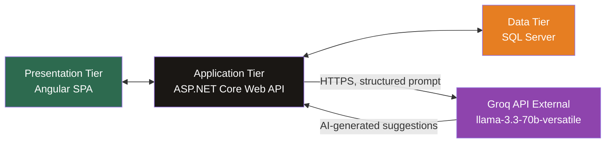
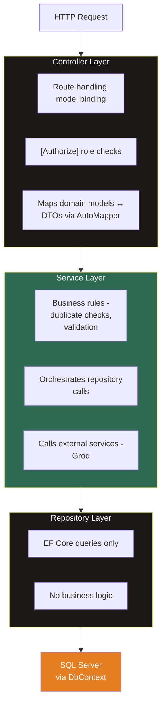
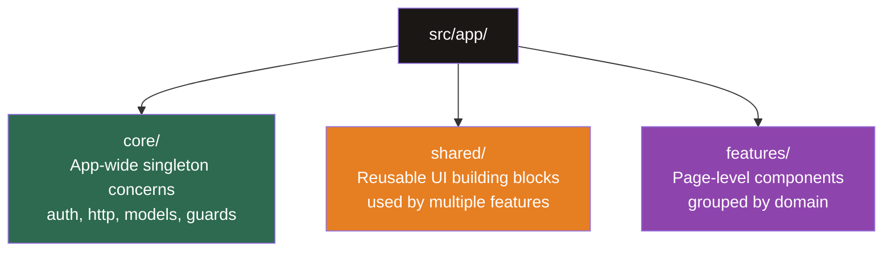
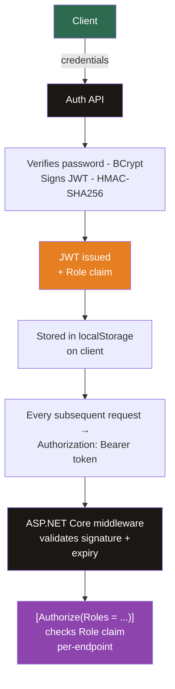
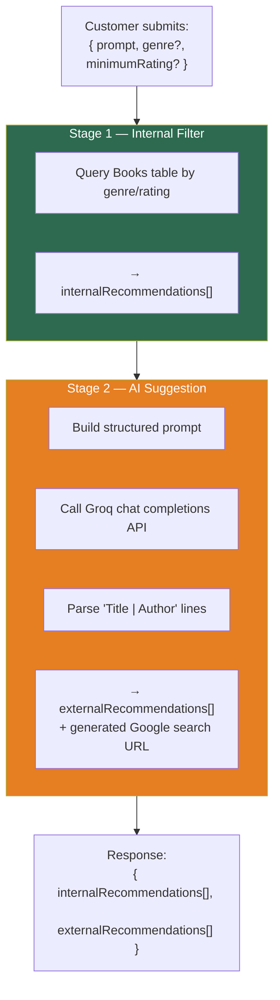
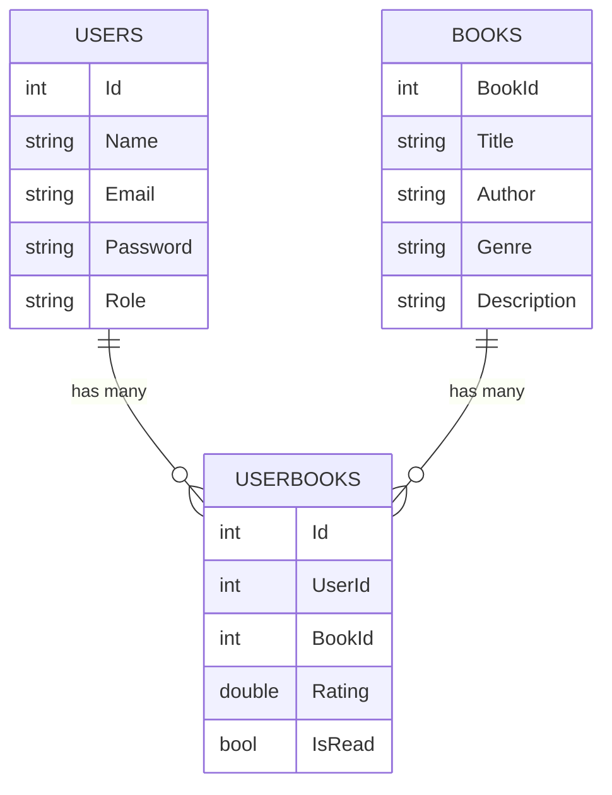
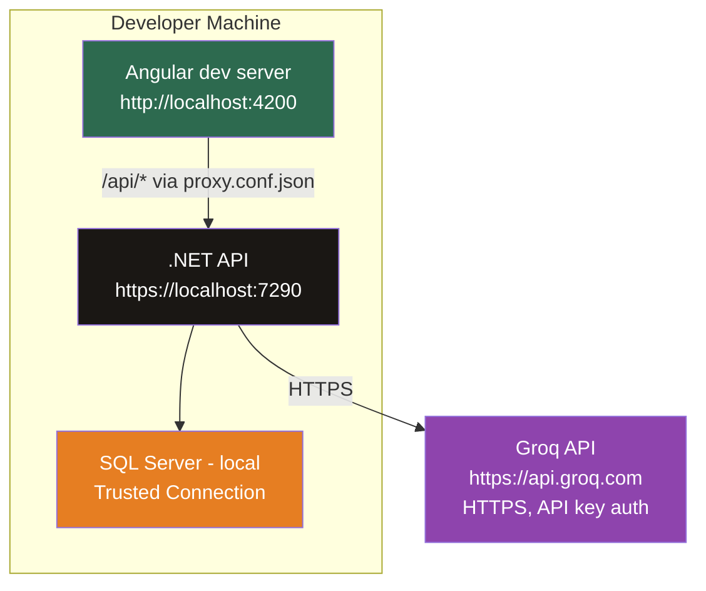

# Architecture Overview
 
## 1. System Type
 
The AI Book Recommendation System is a **three-tier client-server application**:
 

 
The frontend never talks to Groq directly — all AI calls are proxied through the backend, so the API key is never exposed to the client.
 
---
## 2. Layered Backend Architecture
 
The backend follows a strict **Repository → Service → Controller** pattern, with a separate DTO layer for all data crossing the API boundary.
 

 
**Why this separation:**
- Controllers stay thin — they only handle HTTP concerns.
- Services hold all business rules in one place, independent of how data is fetched or how the result will be transported.
- Repositories can be mocked in unit tests (via interfaces), letting service logic be tested without touching a real database.
- DTOs prevent leaking EF Core entity internals (e.g. navigation properties, tracking metadata) to the client.
A global exception-handling **middleware** sits in front of the controller pipeline, so most controller actions don't need explicit try/catch blocks — unhandled exceptions are caught centrally and returned in the standard `ApiResponse` envelope.
 
---
## 3. Frontend Architecture
 
The Angular app uses **standalone components**  organized by responsibility:
 

 
**Routing & access control** is handled by functional guards (`authGuard`, `adminGuard`, `customerGuard`) composed at the route definition level — not inside components. This keeps authorization logic declarative and centralized in `app.routes.ts` rather than scattered across component constructors.
 
**Cross-cutting HTTP concerns** (attaching the JWT) are handled by a functional **interceptor**, registered once in `app.config.ts`, rather than manually added to every service method.
 
---
## 4. Authentication & Authorization Architecture
 

 
Role enforcement happens at **two independent layers**:
1. **Frontend route guards** — prevent navigating to a restricted page (UX-level gatekeeping).
2. **Backend `[Authorize(Roles = ...)]` attributes** — the actual security boundary; the frontend guard alone is not sufficient since a user could call the API directly.
This dual-layer approach means the frontend guard is purely for user experience (e.g. don't even render a page you'll get rejected from), while the backend attribute is the system's real authorization boundary.
 
---

## 5. Recommendation Engine Architecture (Hybrid AI)
 
The recommendation feature is the most architecturally distinct part of the system, since it's the only flow that integrates a synchronous external API call into the request lifecycle.
 

 
This stage separation means a failure in Stage 2 (e.g. Groq API timeout or rate limit) currently fails the entire request — see [Assumptions & Limitations](./assumptions.md) for known constraints around this.

---

 ## 6. Data Model Relationships
 

 
`UserBooks` is a join entity capturing **per-user, per-book** state — both the read status and rating live here, not on the `Books` table directly. This is what allows `averageRating` to be computed dynamically (aggregating across all `UserBooks` rows for a given `BookId`) rather than stored as a static column that would need manual recalculation on every new rating.
 
---
## 7. Deployment Topology (Current — Local Development)
 

 
The Angular dev server proxies `/api/*` requests to the local backend via `proxy.conf.json`, simulating same-origin behavior during development. No containerization or cloud deployment is currently configured — see [Assumptions & Limitations](./assumptions.md).

 