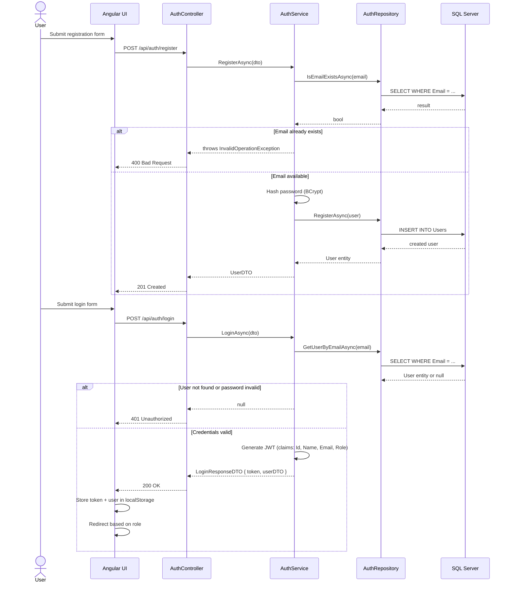
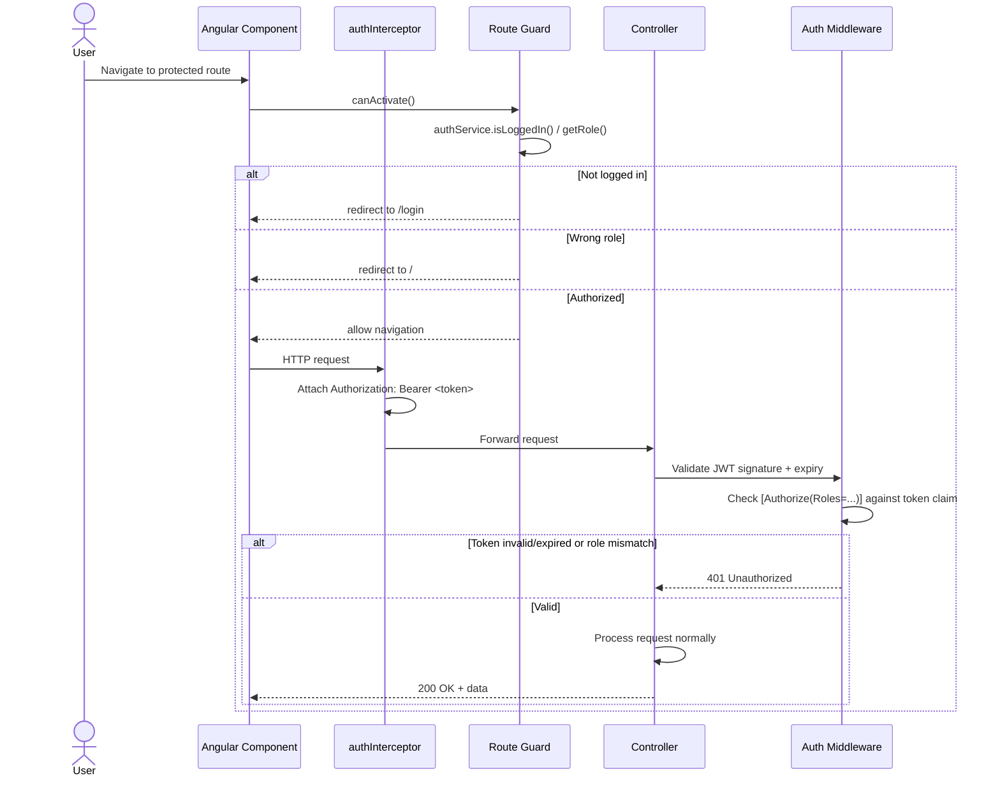
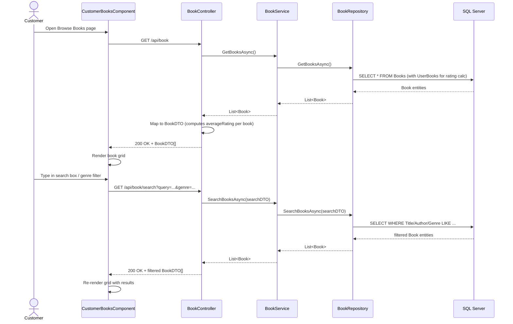
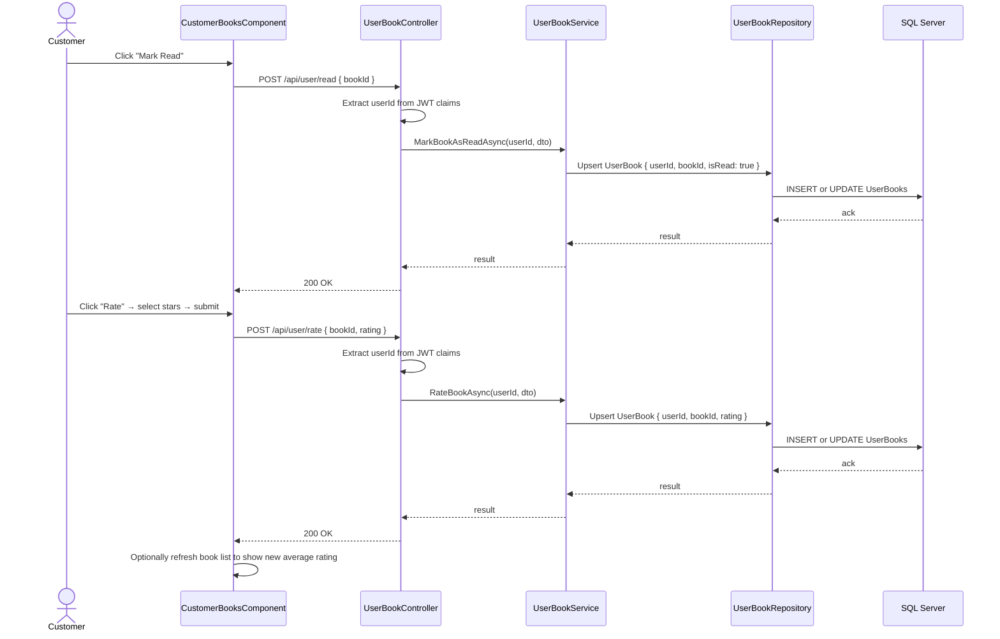
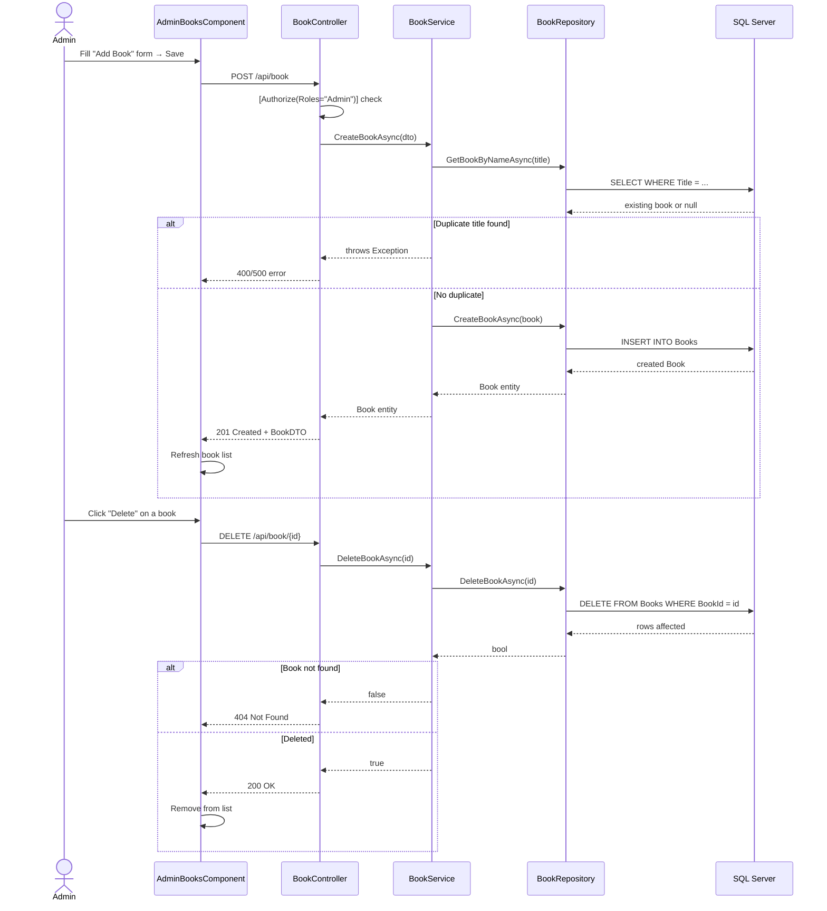
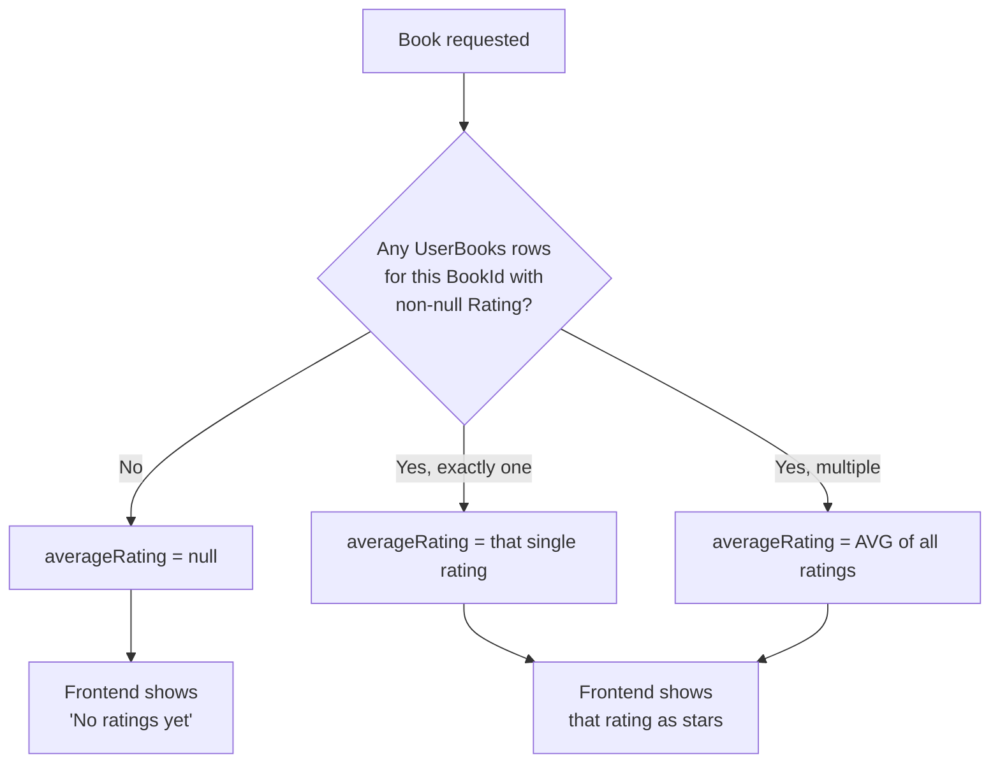

# Data Flow & Sequence Diagrams

Detailed request-level flows for every major feature. For the high-level system architecture, see [architecture.md](./architecture.md).

---

## 1. Registration & Login

---

## 2. Authenticated Request Flow (Generic)

Applies to every protected endpoint after login.

---

## 3. Book Browsing & Search (Customer)

---

## 4. Mark as Read & Rate Book

---

## 5. AI Recommendation Flow (Detailed)

This is the most complex flow in the system — the only one involving a synchronous external API call mid-request.

```mermaid
sequenceDiagram
    actor Customer
    participant UI as RecommendationComponent
    participant API as RecommendationController
    participant Svc as RecommendationService
    participant DB as SQL Server
    participant Groq as Groq API

    Customer->>UI: Enter prompt + optional genre/minRating
    UI->>API: POST /api/recommendation
    API->>Svc: GetRecommendationAsync(requestDTO)

    rect rgb(7, 39, 23)
    Note over Svc,DB: Stage 1 — Internal DB Filter
    Svc->>DB: Query Books WHERE Genre LIKE ... 
    DB-->>Svc: matching Book entities
    Svc->>Svc: Filter further by avg rating ≥ minimumRating
    Svc->>Svc: internalRecommendations = mapped BookDTO[]
    end

    rect rgb(157, 82, 13)
    Note over Svc,Groq: Stage 2 — AI Suggestion
    Svc->>Svc: Build structured prompt (genre + user interest)
    Svc->>Groq: POST /openai/v1/chat/completions
    Groq-->>Svc: { choices: [{ message: { content: "Title | Author\n..." } }] }
    Svc->>Svc: Split response into lines, parse "Title | Author"
    end

    rect rgb(109, 9, 148)
    Note over Svc,DB: Stage 3 — Deduplication
    loop for each AI-suggested book
        Svc->>Svc: Check if title exists in already-fetched DB books
        alt Exists internally
            Svc->>Svc: Skip (already covered by internalRecommendations)
        else Doesn't exist
            Svc->>Svc: Generate Google search URL
            Svc->>Svc: Add to externalRecommendations[]
        end
    end
    end

    Svc-->>API: RecommendationResponseDTO
    API-->>UI: 200 OK { internalRecommendations, externalRecommendations }
    UI->>UI: Render two-column result view
```

---

## 6. Admin Book Management (CRUD)

---

## 7. Average Rating Computation (Conceptual Flow)

Not a request flow, but worth documenting since it's a recurring computed value across multiple endpoints (`GET /api/book`, `GET /api/book/{id}`, search, recommendations).

This computation happens **every time** a book is fetched — there is no cached or stored `AverageRating` column on the `Books` table, by design (see [Assumptions & Limitations](./assumptions.md)).